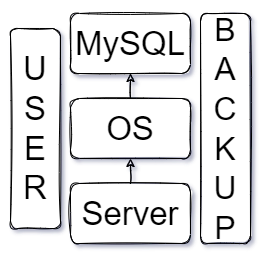

# Cloud 

## DBaaS

The On-premise database include:

+ Server
+ Operating System
+ Database server (MySQL)

Along with this, user management and backup also needs to be considered.

+ Advantages:
    + Full control over the system
    + Full time availability of the data

+ Disadvantages:
    + Extra resources needed to configure and maintain the system
    + Scaling up requires new physical hardware

To overcome this problem, Database as a Service (DBaaS) is adopted by many organisations. 

In DBaaS, the service provider takes care of all the configuration, computation and setup. The user can focus on creating database and warehouses. The user only pays for the service which they are using.

## Types of storage
1. Ephermeral
2. Persistent
    1. Block
    2. File 
    3. Object

---

## Tools

1. [ETCD]("https://etcd.io/")