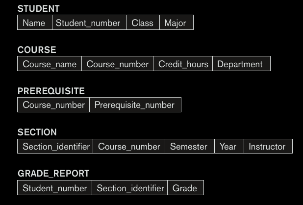

A __database__ is a collection of related data. Data is defined by the facts that can be recorded and have implicit meaning.

A __Database Management System (DBMS)__ is a collection of programs that enables the user to create and maintain the database.

A __DBMS__ is a general purpose software system that allows users to define, construst, manipulate and share the database. __Defining__ involves specifying data types, structure and constraints of the data. The database definition or descriptive information is also stored by DBMS in the for of database called as meta-data. __Constructing__ involves process of storing data on some storage medium that is controlled by DBMS. __Manipulating__ involves quering data and updating the database. __Sharing__ allows multiple users and programs to access the database simultaneosly.

### Capabilities of DBMS

1.  Control redundancy
2.  Authorised access
3.  Persistent storage for program objects
4.  Caching
5.  Backup and recovery
6.  Providing user interface
7.  Representing complex relationship among data 
8.  Enforcing integrity constraints
9.  Permiting inference and action using rules

### Data Model

A collection of objects that can be used to describe the structure of database. The structure of database means data types, relationships and constraints that apply to the data.

### Database schema

The description of database is called schema. It is specified during the design and is not changed frequently. __Schema__ is displayed in the form of diagram known as __schema diagram__. Schema consists of data types of each item, relationships and constraints, which are difficult to show in schema diagrams. 

### Database snapshot or instance

The data in the database at a particular moment in time is called database snapshot or instance of the database.

